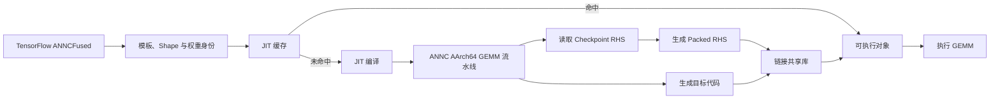
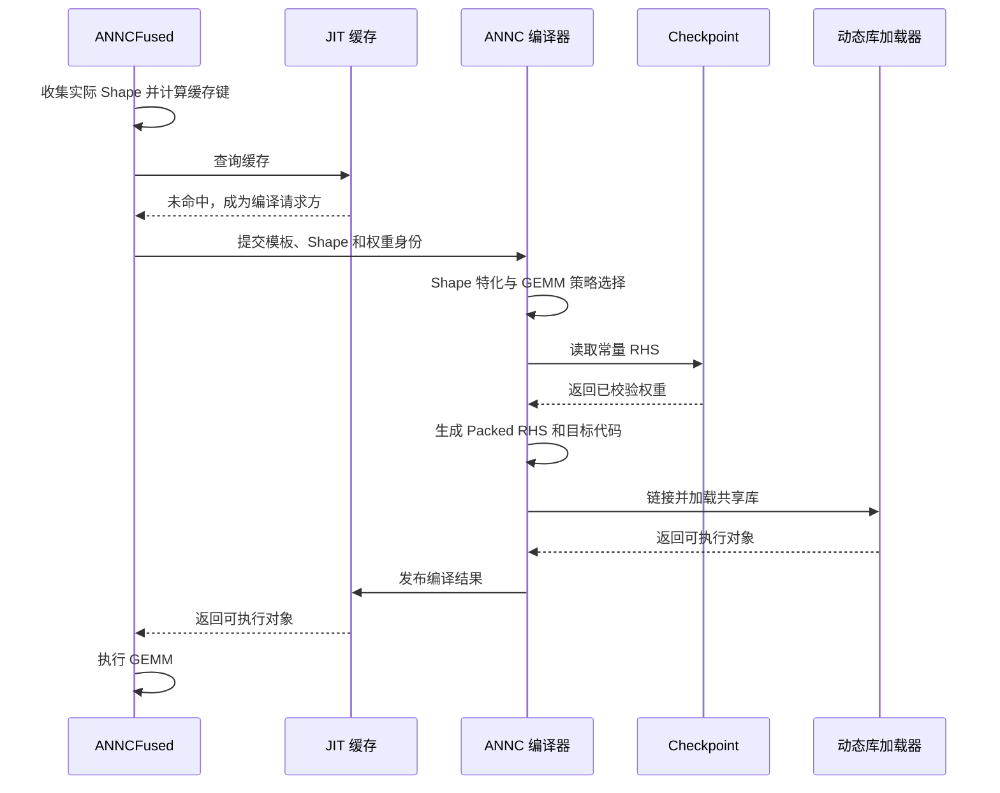
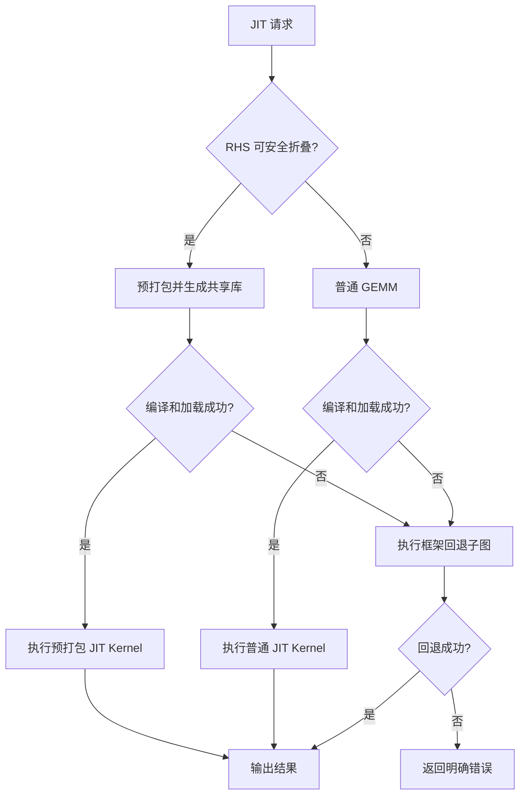

# ANNC JIT 常量折叠特性设计文档

> **文档编号**：ANNC-JIT-CF-ARCH-001  
> **文档版本**：v1.0  
> **发布日期**：2026-09-11 
> **目标受众**：特性、编译器、TensorFlow 集成和测试工程师  
> **文档密级**：公开

## 1 概述

### 1.1 背景

GEMM 微内核通常要求右操作数（RHS）使用特定的 packed 布局。常规执行路径会在每次调用前对 RHS 执行 PackB；对于模型权重不变、同一 kernel 被反复调用的推理场景，这部分工作是重复的。

ANNC 的 JIT 流程会在首次运行时根据实际 shape 生成目标代码。此时编译器已经知道 GEMM 的形状、目标 ISA 和 tiling 参数，因此可以同时读取模型权重并完成 PackB，再把 packed RHS 与生成代码一起放入共享库。后续请求命中缓存后，直接使用 packed RHS 执行 GEMM。

本特性折叠的是 RHS 的 PackB 数据变换，而不是预先计算 GEMM 结果。

### 1.2 目标

本设计解决三个问题：

1. 将不变权重的 PackB 从每次执行移动到首次 JIT 编译；
2. 保证生成代码、packed RHS 和缓存身份始终一致；
3. 在常量折叠或 JIT 失败时保留语义等价的执行路径。

### 1.3 范围

首期支持 AArch64 F32 GEMM，RHS 为 TensorFlow checkpoint 中的静态二维权重，目标 ISA 为 NEON 或 SVE。转置、非 F32、非二维 RHS 和缺少稳定 ABI 的融合 epilogue 不在首期范围内。

AOT 常量折叠和非 GEMM 算子不属于本文档范围。

### 1.4 术语

| 术语 | 含义 |
|---|---|
| JIT | 程序运行期间，根据当时已知信息生成并执行目标代码 |
| PackB | 将 GEMM 的 RHS 重排为目标微内核所需布局 |
| packed RHS | 完成 PackB 后的 RHS 数据 |
| 模板指纹 | 对规范化 ATIR 计算模板生成的摘要 |
| 缓存键 | 判断两个 JIT 请求能否复用同一编译产物的标识 |
| single-flight | 同一缓存键的并发请求只触发一次编译 |

## 2 总体方案

### 2.1 架构

`ANNCFused` 是运行时入口。它根据融合计算模板、实际参数 shape、模型权重身份和编译环境生成缓存键。缓存命中时直接复用可执行对象；未命中时同步执行 JIT 编译。

编译器在 GEMM 策略确定后判断 RHS 是否适合预打包。满足条件时，从 checkpoint 读取 RHS，按目标微内核布局完成 PackB，并与生成代码共同链接进共享库。

### 2.2 首次运行流程

首次请求承担 shape 特化、权重读取、预打包、编译、链接和加载开销。该开销通过后续缓存命中摊销。

### 2.3 缓存命中与并发

缓存键相同的后续请求直接复用已加载的可执行对象，不再读取 checkpoint，也不再执行 PackB、编译或动态库加载。

同一缓存键并发到达时，第一个请求负责编译，其他请求等待并共享结果。不同缓存键可以并行编译，但需要设置进程级并发上限，避免大量新 shape 同时出现时耗尽 CPU 和临时磁盘。

缓存采用有界 LRU。逐出只释放缓存持有的引用；正在执行的请求继续持有可执行对象，最后一个引用释放后再卸载动态库和清理临时目录。

### 2.4 权重与代码的生命周期

packed RHS 与目标代码同属一个共享库，生命周期完全一致。缓存、执行请求和引用计数共同决定资源何时释放：LRU 逐出或请求结束只减少引用计数，最后一个引用释放后才卸载共享库并清理临时目录，避免出现代码仍在执行而权重已被回收的情况。

## 3 核心设计

### 3.1 模板、Shape 与缓存身份

模板指纹用于标识与具体节点名称和运行时 shape 无关的 ATIR 计算语义。规范化过程忽略非语义身份信息和可特化维度，同时保留数据类型、布局、影响 lowering 的属性和内嵌常量。

模板指纹本身不足以标识 checkpoint 权重。完整缓存键还需要包含：

- 实际 ABI 参数 shape；
- 模型或 checkpoint 的不可变版本；
- RHS 变量身份或内容摘要；
- 目标 ISA、GEMM 配置、packed 布局版本；
- 编译器和调用 ABI 版本。

这样可以避免不同模型拥有相同计算结构和 shape 时错误复用彼此的权重，也可以在编译器、配置或布局升级后自动隔离旧产物。

### 3.2 Shape 特化

JIT 请求携带按 kernel ABI 顺序排列的实际输入和输出 shape。编译器先检查形参个数、维度数量和固定维度，之后完成 ATIR shape 推导，并拒绝仍包含动态维度的 kernel。

输出 shape 必须能够由融合元数据和输入 shape 唯一确定。无法可靠推导时应拒绝 JIT，不能使用猜测值分配输出或生成缓存键。

### 3.3 GEMM 执行路径

ANNC 的 AArch64 GEMM 会根据形状选择不同执行路径，常量折叠只作用于其中一条：

| 路径 | 适用形状 | 是否 PackB | 是否可折叠 |
|---|---|---|---|
| small direct | 计算量较小的普通 GEMM | 否 | 否 |
| matvec | N 等于 1 的矩阵向量乘 | 否 | 否 |
| vecmat | M 等于 1 的向量矩阵乘 | 否 | 否 |
| runtime-packed | 常规 GEMM | 每次执行时打包 | 折叠后不再打包 |
| prepacked | 常规 GEMM 且权重常量 | 首次编译时打包 | 是 |

路径选择在编译期一次性确定。prepacked 路径的收益来自把 runtime-packed 路径中每次执行的 PackB 移到首次编译，两者生成的 GEMM 计算部分保持一致。

### 3.4 常量折叠资格

常量折叠只适用于需要 PackB 的普通 GEMM。无需打包的 small direct、matvec 和 vecmat 路径不进行 RHS 预打包。

RHS 进入预打包路径需要满足以下核心条件：

- GEMM 形状和布局受支持；
- RHS 是静态二维 F32 权重；
- RHS 具有稳定、可验证的 checkpoint 身份；
- 权重大小达到预打包收益阈值；
- 目标 ISA 的 packer 和 packed 布局版本可用。

如果条件不满足，编译器保留普通 direct 或 runtime-packed GEMM，不应因为优化条件不足而中断合法计算。

### 3.5 Checkpoint 与权重身份

Checkpoint Reader 在受控模型目录中定位权重文件，根据完整变量身份读取 RHS，并检查数据类型、形状和数据长度。

模型发布应使用不可变 checkpoint 版本。权重身份同时进入 JIT 缓存键和 packed RHS 元数据，确保缓存中的代码与权重对应。模型更新后产生新的缓存键，不复用旧共享库。

Reader 需要限制输入文件大小并验证边界，拒绝损坏数据和越界访问。变量匹配必须依赖稳定身份，不使用模糊名称搜索。

### 3.6 RHS 预打包

预打包过程复用 GEMM cache blocking 的 KC、NC 参数，按与运行时微内核一致的顺序处理 K 和 N 分块。NEON 与 SVE 使用独立的 packed 布局版本。

packed RHS 元数据至少描述：

| 信息 | 作用 |
|---|---|
| 布局版本 | 标识 packer 与微内核的布局契约 |
| K、N | 校验原始 RHS 形状 |
| KC、NC | 校验分块方式 |
| 数据符号 | 在共享库中定位 packed RHS |
| 元素数量与对齐 | 校验存储范围和访问要求 |
| 权重身份 | 校验 packed 数据所属模型版本 |

在 GEMM plan 最终确定后，编译器重新核对这些信息，避免策略、tiling 和 packed 数据之间不一致。

### 3.7 代码生成与加载

packed RHS 作为只读、对齐的全局数据参与共享库链接。生成的 GEMM 代码通过全局符号访问该数据，不再创建 PackB workspace，也不生成运行时 PackB 调用。

JIT 编译使用私有工作目录保存 shape 描述、lowered IR、packed 数据对象和共享库。编译完成后校验目标文件和 ABI，再通过 `dlopen`/`dlsym` 加载 kernel。

编译子进程应使用参数数组和最小环境，避免 shell 注入或不必要的环境变量影响编译结果。

### 3.8 缓存与并发控制

JIT 缓存同时管理三类状态：

| 状态 | 含义 | 约束 |
|---|---|---|
| 就绪 | 已完成编译并可复用 | 受 LRU 容量限制 |
| 编译中 | 有请求正在生成产物 | 受并发编译上限约束 |
| 失败 | 最近一次编译失败 | 不进入就绪队列，可按策略重试 |

编译过程不持有缓存全局锁，避免长时间编译阻塞其他请求。等待同一缓存键的请求通过条件变量获得通知。缓存统计信息用于观测命中率、编译时长和逐出行为，为容量配置提供依据。

## 4 失败处理

### 4.1 失败路径

常量折叠是可选优化，不应成为 GEMM 正确执行的必要条件。checkpoint 缺失、权重校验失败或 packer 不可用时，编译器改用普通 GEMM。整个 JIT 编译或动态库加载失败时，执行 `ANNCFused` 框架保留的回退子图。

### 4.2 失败分类与恢复

| 失败类别 | 典型原因 | 恢复方式 |
|---|---|---|
| 资格不满足 | 形状、布局或权重身份不受支持 | 直接选择普通 GEMM，不视为错误 |
| 数据不可用 | checkpoint 缺失、损坏或权限不足 | 放弃折叠，使用普通 GEMM |
| 编译失败 | lowering、链接或资源不足 | 清理产物并执行框架回退 |
| 加载失败 | 共享库损坏或符号缺失 | 卸载句柄并执行框架回退 |
| 并发过载 | 新 shape 大量同时到达 | 排队等待或直接回退 |

同一缓存键的编译失败会通知所有等待请求。失败产物不进入正常缓存，临时目录及时清理。对于确定性输入错误不自动重试；临时资源故障可采用有限重试或短期熔断。

### 4.3 降级一致性

无论选择哪条执行路径，输出语义必须一致。降级只发生在输出对外可见之前；kernel 部分写入输出后不允许切换路径。回退子图与 JIT kernel 使用相同的输入输出约定，保证上层业务无需感知执行方式变化。

## 5 接口边界

### 5.1 ANNCFused

`ANNCFused` 需要携带以下信息：

- kernel 名和 ATIR 模板位置；
- 模板指纹；
- 输入输出的维度数量和参数顺序；
- 输出 shape 规则；
- 模型版本和权重身份；
- 调用 ABI 版本；
- JIT 失败时的回退函数。

这些信息由图重写阶段生成，并在运行时用于 shape 特化、缓存身份和错误恢复。

### 5.2 编译器与运行时

运行时向编译器传递模板、实际 shape、目标配置和权重身份。编译器输出共享库及对应元数据。运行时加载前校验：

- kernel 符号存在；
- ABI 版本匹配；
- packed 布局版本匹配；
- 模型和权重身份与请求一致。

### 5.3 版本管理

模板指纹、缓存键、packed 布局和 GEMM ABI 分别维护版本。任何会改变语义、数据布局或调用方式的变更，都必须改变对应版本并进入缓存键。

版本变化不需要迁移旧缓存。旧可执行对象要么被自然逐出，要么随模型版本切换被清理。

## 6 可靠性与安全

### 6.1 可靠性

| 场景 | 处理方式 |
|---|---|
| 输出 shape 无法确定 | 拒绝 JIT，执行回退路径 |
| checkpoint 缺失或损坏 | 放弃常量折叠，使用普通 GEMM |
| packed 元数据不一致 | 拒绝 packed RHS，重新选择执行路径 |
| 编译、链接或加载失败 | 清理中间产物并执行框架回退 |
| 同一请求并发编译 | single-flight 共享结果 |
| 缓存逐出时 kernel 仍在执行 | 通过引用计数延迟卸载 |
| 模型或编译配置变化 | 生成新的缓存键 |

### 6.2 资源控制

JIT 缓存、并发编译数量和工作目录空间都需要设置进程级上限。缓存逐出按 LRU 执行；编译任务超过并发上限时排队或直接回退。服务退出时释放动态库并清理工作目录，调试保留产物必须显式开启。

### 6.3 安全

Checkpoint、ATIR、编译配置和生成的共享库都属于信任边界。设计要求：

- checkpoint 与工作目录限制在允许的根路径内；
- 临时目录仅当前用户可访问；
- 文件读取具有大小和边界检查；
- 编译子进程不通过 shell 拼接命令；
- 加载前校验共享库路径、所有者和 ABI；
- 日志不记录权重内容和敏感模型路径。

## 7 可观测性

运行时至少记录：

- 缓存命中、未命中、等待、逐出和失败；
- JIT 编译、权重读取、PackB、链接和加载耗时；
- packed RHS 大小和布局版本；
- 回退阶段和原因；
- 当前缓存项、编译队列和工作目录使用量。

日志应包含缓存键摘要、模型版本、目标 ISA 和 ABI 版本，但不包含权重内容。

指标用于回答三个运维问题：缓存配置是否合理、编译耗时是否影响首请求延迟、失败是否集中在某一类输入。

## 8 验收方案

### 8.1 功能验收

功能验收关注以下方面：

1. 满足条件的 RHS 被预打包，生成代码不再调用运行时 PackB；
2. 不满足条件或权重读取失败时，普通 GEMM 能正确执行；
3. prepacked、runtime-packed 和 direct 路径数值一致；
4. 相同请求只编译一次，不同 shape 或权重不会错误命中；
5. 缓存逐出不影响正在执行的 kernel；
6. 编译、链接和加载故障能够执行回退路径；
7. NEON/SVE、单线程/多线程和各类 tail shape 均通过验证。

### 8.2 性能验收

性能验收需要分别测量首次 JIT 和缓存命中后的稳态性能。prepacked 与 runtime-packed 使用相同输入、线程、绑核和预热条件，报告 kernel 延迟、端到端延迟和首次编译成本的收益摊销点。

### 8.3 安全与鲁棒性验收

安全与鲁棒性验收包括损坏 checkpoint、路径越界、超大输入、编译超时、非法共享库和并发编译风暴。

验收不应止于确认"生成了 packed 数据"。缓存身份是否完整、失败是否可降级、资源生命周期是否安全，同样是必须覆盖的验收维度。

## 9 部署约束

启用 JIT 常量折叠前需要确认：

- checkpoint 以不可变版本发布；
- GEMM 配置与目标 CPU 匹配；
- 目标 packer 和微内核可用；
- 回退子图完整可执行；
- 缓存、编译并发和磁盘配额已配置；
- 模板指纹、缓存键、packed 布局和 ABI 版本一致。

编译器或 packed 布局升级后，旧缓存不能被新版本请求命中。服务启动时清理不再属于有效模型版本的 JIT 工作目录。
