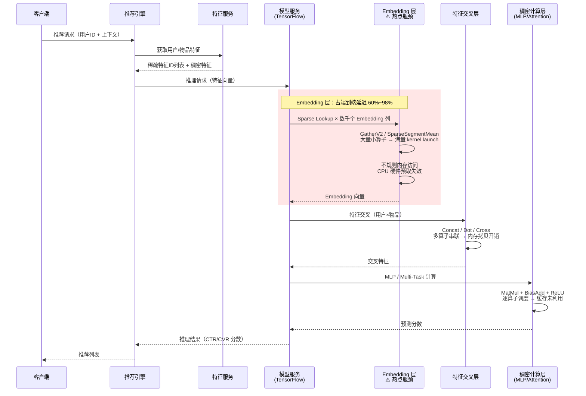
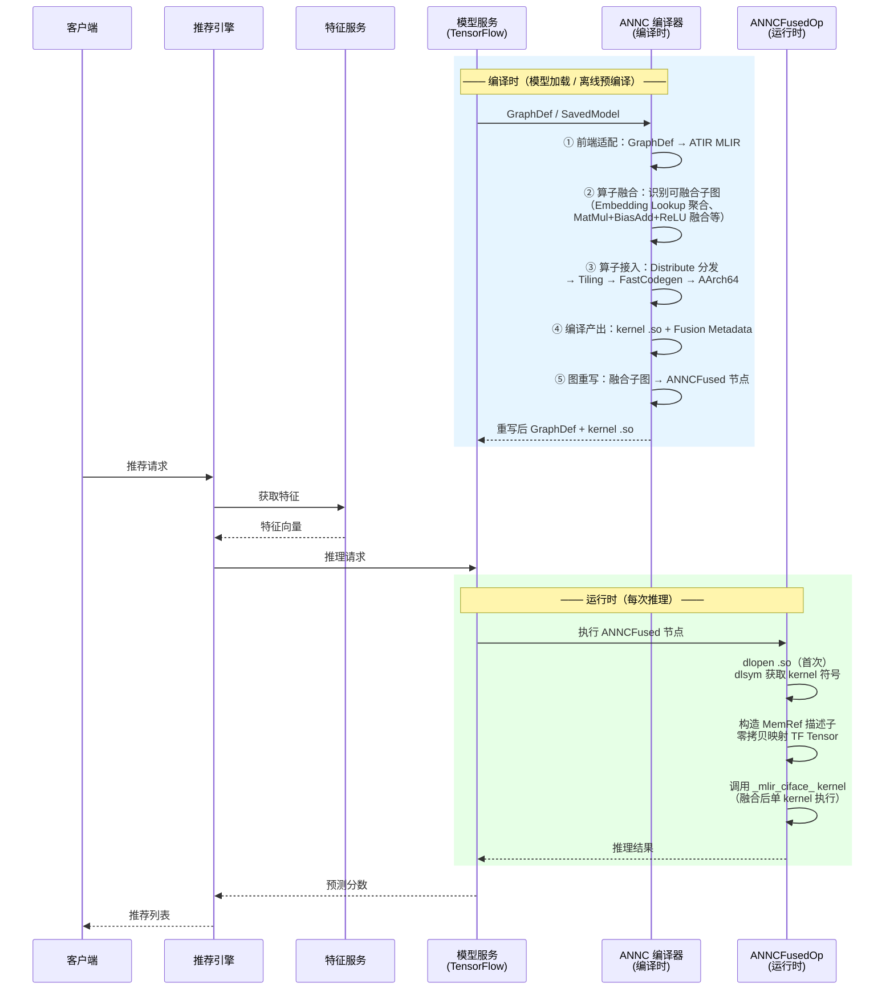
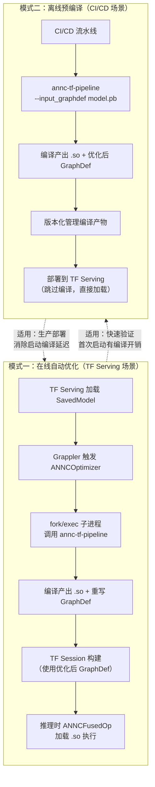
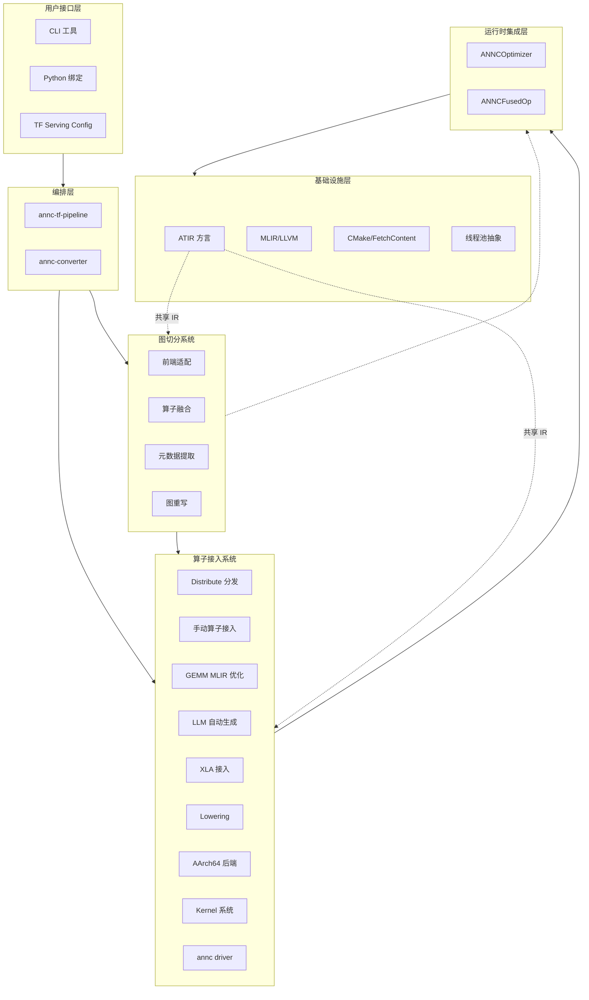
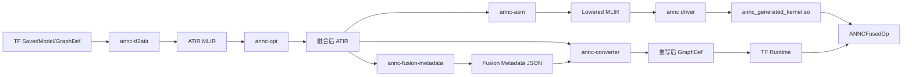
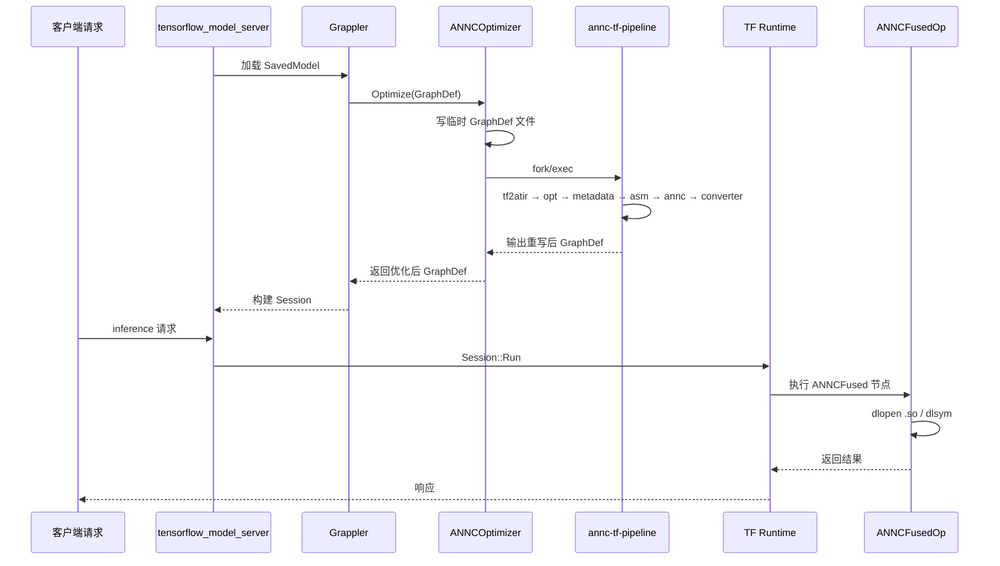
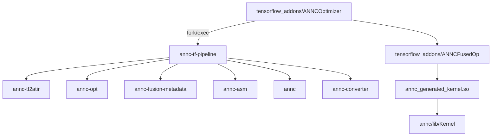

# ANNC 架构设计文档

> **文档编号**：ANNC-ARCH-001\
> **文档版本**：v3.0\
> **发布日期**：2026-06-15\
> **目标受众**：架构评审、产品经理、开发工程师、测试工程师、运维工程师\
> **文档密级**：公开\
> **变更说明**：v3.0 按 IPD 文档模板重构，从实现细节导向转为特性需求、场景分析、架构设计、可靠性/安全/非功能质量属性全维度描述。

***

## 1 概述

### 1.1 目的

本文档用于定义 **ANNC（Accelerated Neural Network Compiler）** 的架构设计，明确产品定位、特性需求、需求场景、功能实现原理、可靠性/安全/非功能质量属性设计，以及需求分解与信息需求。本文档是 ANNC 产品开发、测试、部署、运维的架构基线，供项目团队成员、架构评审人员及相关利益方使用。

### 1.2 范围

**本文档覆盖范围**：

- ANNC 的产品定位与核心特性需求。
- AI 推理场景下的需求场景分析。
- 图切分系统、算子接入系统、运行时集成系统的架构设计。
- 关键接口契约（ATIR 映射、Fusion Metadata、ANNCFused Op、Kernel C ABI）。
- 可靠性、安全/隐私/韧性、非功能质量属性设计。
- 需求分解、信息需求、参考资料。

**本文档不覆盖范围**：

- 模型训练相关功能。
- 非推理场景（如离线数据分析、通用科学计算）。
- 具体命令行用法、构建步骤、源码实现细节（见 `README.md`、`AGENTS.md`）。

***

## 2 需求概述

### 2.1 产品定位

**ANNC（Accelerated Neural Network Compiler）** 是面向 CPU 场景的 AI 推理编译器。它将 CPU 微架构优化能力（算子融合、多级 tiling、数据打包、向量化）从具体推理框架中解耦，通过自定义统一 IR（ATIR）实现一次优化、多框架复用；以 AOT 编译产出原生 kernel，再通过框架插件透明回接，让不同框架的客户无需修改业务代码即可获得 CPU 原生推理性能。当前优先支持 AArch64 平台（鲲鹏 920X）。

### 2.2 核心问题

- **搜索推荐广告推理的 Embedding 热点瓶颈**：搜推广（搜索、推荐、广告）是 CPU 推理的最大业务场景，深度推荐模型（如 DLRM）已占数据中心 ML 推理算力周期的 70% 以上。而推荐模型的核心瓶颈集中在 Embedding 层：生产模型中 Embedding Lookup 的执行时间占端到端推理延迟的 60% 以上，部分场景甚至超过 98%（ASPLOS 2024, RECom）。Embedding 层包含大量稀疏查表（Sparse Lookup）、特征交叉（Feature Interaction）等小算子，框架默认实现产生海量 kernel launch 和内存分配开销，且其不规则内存访问模式导致 CPU 硬件预取失效、缓存命中率极低，是 CPU 推理性能未释放的典型缩影。
- **优化能力碎片化**：由于客户使用不同框架（TensorFlow、ONNX Runtime、PyTorch 等）。每次针对 CPU 微架构的融合算子优化（如 MatMul+BiasAdd+ReLU 融合 + NEON/SVE tiling + 缓存打包）和矩阵优化都必须基于具体框架逐一适配，优化能力无法跨框架复用，导致：
  - 同一优化策略在不同框架上重复实现，研发效率低；
  - 新框架/新版本接入时优化能力滞后，客户体验差；
  - 优化深度受限于框架适配投入，难以持续迭代。
- **生态兼容性约束**：客户希望在 CPU 服务器上获得高性能推理的同时，保持与现有 TF/ONNX 业务生态的兼容，不愿或者尽量少修改模型和推理代码。

### 2.3 解决思路

ANNC 通过三层解耦架构解决上述问题：

- **前端适配与图切分层**：对接不同推理框架，将模型转换为框架无关的统一 IR（ATIR），并识别可融合子图、执行图重写，隔离框架差异。
- **算子接入层**：在 ATIR 之上沉淀 CPU 优化能力（融合、tiling、向量化、手动/自动算子接入），使优化逻辑与框架解耦，一次实现、多框架受益。
- **运行时集成层**：将编译产物以插件形式透明回接到原框架，失败自动回退，不破坏已有推理路径。

核心价值：

- **复用价值**：通过统一 IR（ATIR）将 CPU 优化能力从框架中解耦，一次优化实现即可覆盖多框架，新增框架仅需开发前端适配器，边际成本趋近于零。
- **性能价值**：通过 AOT 编译、算子融合、CPU 微架构原生优化，显著提升推理吞吐、降低时延。
- **能效价值**：减少无效内存访问和调度开销，降低单位推理功耗。
- **生态价值**：以插件形式透明集成，业务无需修改模型和推理代码。
- **可靠性价值**：编译失败自动回退原生执行，不破坏已有推理路径。

## 3 需求场景分析

### 3.1 典型场景：搜推广推理与 ANNC 接入

搜推广（搜索、推荐、广告）是 CPU 推理的最大业务场景，其模型结构具有高度共性：大规模稀疏 Embedding 查表 + 特征交叉 + 稠密 MLP 计算。以下以推荐场景为例，**当前以 TensorFlow 为例**说明 ANNC 的接入方式（ONNX Runtime、PyTorch 等框架的接入架构一致，仅需开发对应前端适配器）。

#### 3.1.1 搜推广推理典型流程（当前现状）

**现状痛点标注**：

| 阶段          | 痛点              | 根因                                                                                       |
| ----------- | --------------- | ---------------------------------------------------------------------------------------- |
| Embedding 层 | 占端到端延迟 60%\~98% | 数千个小算子（GatherV2、Unique、SparseSegmentMean 等）产生海量 kernel launch 和内存分配；不规则内存访问导致 CPU 硬件预取失效 |
| 特征交叉层       | 中间结果频繁落内存       | Concat/Dot/Cross 等算子串联执行，每步输出写回内存再读入，缓存利用率低                                              |
| 稠密计算层       | 算子粒度调度开销大       | MatMul+BiasAdd+ReLU 本可融合为单个 kernel，但框架逐算子调度，无法利用 CPU 向量化和缓存层次                            |

#### 3.1.2 ANNC 接入后的搜推广推理流程

ANNC 通过**编译时优化 + 运行时透明回接**接入搜推广推理链路，核心改造集中在模型服务内部，推荐引擎和特征服务无需任何变更。

**ANNC 接入的关键改造点**：

| 改造点                 | 改造前             | 改造后                       | 效果                              |
| ------------------- | --------------- | ------------------------- | ------------------------------- |
| Embedding Lookup    | 数千个小算子逐一调度      | 多个 Embedding 列聚合为融合子图     | kernel launch 开销从 O(数千) 降至 O(1) |
| MatMul+BiasAdd+ReLU | 三个独立算子，中间结果落内存  | 融合为单个 kernel，tiling + 向量化 | 消除中间内存读写，利用 NEON/SVE 向量指令       |
| 特征交叉                | Concat/Dot 串联执行 | 融合进 ANNCFused 子图          | 缓存数据复用，减少内存拷贝                   |
| 接入方式                | 手动修改模型代码        | Grappler 插件自动触发 / 离线 CLI  | 业务零改造，编译失败自动回退                  |

#### 3.1.3 ANNC 接入的两种部署模式

| 模式     | 触发时机             | 优势              | 劣势           | 适用场景       |
| ------ | ---------------- | --------------- | ------------ | ---------- |
| 在线自动优化 | TF Serving 加载模型时 | 零运维，业务无感知       | 首次启动有编译延迟    | 快速验证、小规模部署 |
| 离线预编译  | CI/CD 模型发布阶段     | 消除启动编译延迟，产物可版本化 | 需额外 CI/CD 步骤 | 生产环境大规模部署  |

#### 3.1.4 衍生场景

基于搜推广主场景，ANNC 还支持以下衍生使用方式：

| 场景            | 目标用户          | 触发条件                   | 输入                            | 输出                  | 价值                           |
| ------------- | ------------- | ---------------------- | ----------------------------- | ------------------- | ---------------------------- |
| ATIR 原型开发与验证  | 编译器算法工程师      | 算法验证、新融合模式开发           | Python 构建的 ATIR MLIR          | 验证结果、lowering 后的 IR | 在完整 pipeline 之外快速迭代新算子、新融合策略 |
| 自定义 Kernel 集成 | 后端/kernel 开发者 | 接入 KDNN、手写 SIMD kernel | 符合 ANNC Kernel 接口的 C++ kernel | 被编译流水线识别并调用的 kernel | 扩展 ANNC 后端能力，复用 vendor 优化    |
| TF↔ATIR 双向转换  | 调试工程师         | 模型调试、可视化               | TF SavedModel ↔ ATIR MLIR     | 双向转换结果              | 便于问题定位、结果对比、生态互操作            |

### 3.2 特性影响分析

| 影响维度                | 影响说明                                 | 应对措施                                |
| ------------------- | ------------------------------------ | ----------------------------------- |
| **优化能力复用效率**        | 新框架接入时仅需开发前端适配器，复用已有 ATIR 优化和算子接入能力  | 定义稳定的 NodeInfo 接口契约，降低前端适配成本        |
| **前端适配覆盖度**         | 当前仅 TF 前端完整，ONNX 在规划中，PyTorch 未纳入    | 优先覆盖客户量最大的框架，通过 NodeInfo 抽象降低边际适配成本 |
| **TF Serving 启动时延** | 首次加载模型需执行编译 pipeline                 | 离线预编译、图优化缓存（未来）、合理设置 timeout        |
| **磁盘空间**            | 构建 LLVM/MLIR 需约 50GB                 | 构建机独立环境、增量构建                        |
| **构建环境**            | 依赖 openEuler、鲲鹏 920X、TensorFlow 2.15 | 明确依赖清单，提供 build.sh 一键构建             |
| **运维监控**            | 需要观察编译失败、超时、回退事件                     | 统一日志、关键事件埋点                         |
| **模型兼容性**           | 部分 TF 算子/动态 shape 可能不支持              | 失败自动回退，持续扩展算子覆盖                     |

***

## 4 特性/功能实现原理

### 4.1 总体方案

#### 4.1.1 架构分层

ANNC 从逻辑上分为六层：

#### 4.1.2 数据流总览

从 AI 模型到 AArch64 原生 kernel 的完整数据流：

> **路径说明**：GEMM 类算子（MatMul+Add+ReLU）走 `annc-opt → Distribute → Tiling → FastCodegen → AArch64` 特化路径；Embedding Lookup 聚合等非 GEMM 融合子图走 `annc-opt → 通用 MLIR Lowering → Affine/Linalg → AArch64` 标准路径。两条路径在 `annc-asm` 阶段汇合，后续流程一致。

#### 4.1.3 编译时与运行时边界

| 阶段      | 触发时机                 | 执行主体                   | 主要工作                               | 失败行为             |
| ------- | -------------------- | ---------------------- | ---------------------------------- | ---------------- |
| **编译时** | TF Session 创建 / 离线调用 | `ANNCOptimizer` 子进程    | 图切分、算子接入、图重写                       | 返回原始 GraphDef    |
| **运行时** | 每次推理请求               | `ANNCFusedOp::Compute` | `dlopen` `.so`、构造 MemRef、调用 kernel | 报错（当前无 fallback） |

关键设计：**编译时尽可能多做，运行时只做最小必要的事**。

#### 4.1.4 关键架构决策记录

项目关键架构决策统一维护在 `docs/ADR/` 目录：

- 索引与机制说明：`docs/ADR/README.md`
- 详细决策内容：`docs/ADR/decisions.md`

当前已记录的决策包括：

- ADR-001：采用统一 IR（ATIR）而非框架专属优化
- ADR-002：编译器三层解耦（前端/优化/运行时）
- ADR-003：两层选择算子接入策略
- ADR-004：fork/exec 进程隔离
- ADR-005：运行时无 fallback 决策

#### 4.1.5 关键接口契约

三层解耦通过三个接口契约连接，确保各层独立演进时不会破坏跨层协作：

| 接口契约                | 格式                              | 产生方                         | 消费方                 | 核心字段                                                                              | 稳定性承诺                                                                     |
| ------------------- | ------------------------------- | --------------------------- | ------------------- | --------------------------------------------------------------------------------- | ------------------------------------------------------------------------- |
| **NodeInfo**        | C++ struct（`annc/lib/Builder/`） | 前端适配（annc-tf2atir）          | ATIR 方言构建           | `op_type`、`name`、`inputs`、`outputs`、`dtype`、`shape`、`attrs`                       | `op_type`/`dtype` 不可变；`attrs` 可按前端扩展                                      |
| **Fusion Metadata** | JSON（`annc-fusion-metadata` 输出） | 元数据提取（annc-fusion-metadata） | 图重写（annc-converter） | `fusion_pattern`、`fused_nodes`、`input_mapping`、`output_mapping`、`shared_lib_path` | `fused_nodes`/`input_mapping`/`output_mapping` 不可变；`fusion_pattern` 可扩展新值 |
| **Kernel C ABI**    | C 函数签名（`_mlir_ciface_*`）        | 算子接入（annc driver 编译产出）      | 运行时集成（ANNCFusedOp）  | 函数名、参数列表（MemRef 描述子指针）、返回值                                                        | 函数名编码规则不可变；MemRef 布局遵循 MLIR 标准约定                                          |

**设计要点**：

- NodeInfo 是前端适配与图切分层内部的数据通道，将前端适配产出传递给 ATIR 方言构建；新增前端（如 ONNX）仅需实现 NodeInfo 构建器。
- Fusion Metadata 是图切分层内部（元数据提取→图重写）的解耦接口，使 annc-fusion-metadata 和 annc-converter 可独立迭代。
- Kernel C ABI 是算子接入层与运行时集成层之间的唯一调用约定，kernel 的内部实现（手写/MLIR 生成）对运行时透明。

### 4.2 特性功能性设计

#### 4.2.1 图切分系统

**职责**：回答"哪些算子可以合并"以及"如何替换为 ANNCFused 节点"。

| 组件      | 职责                           | 输入                         | 输出                        |
| ------- | ---------------------------- | -------------------------- | ------------------------- |
| 前端适配    | 将外部模型格式转换为与运行时无关的 `NodeInfo` | GraphDef `.pb`             | `NodeInfo` 列表             |
| ATIR 方言 | 作为图切分与算子接入的统一 IR             | `NodeInfo` 列表              | ATIR MLIR                 |
| 算子融合    | 识别并合并可融合子图                   | ATIR MLIR                  | 融合后 ATIR                  |
| 元数据提取   | 提取 Fusion Metadata JSON      | 融合后 ATIR                   | Fusion Metadata JSON      |
| 图重写     | GraphDef 重写 / ATIR→TF 逆向     | ATIR + GraphDef + Metadata | 重写后 GraphDef / SavedModel |

**关键设计要点**：

- 前端适配不链接 TF Runtime，通过 `NodeInfo` 隔离前端差异，为 ONNX 等后续前端预留扩展点。
- ATIR `TensorType` 类型携带数据（cacheData），使常量折叠和验证无需外部存储。
- 默认流水线启用 `OpFusion`；`BlockFusion`、`EltwiseFusion` 稳定后纳入。
- 算子融合支持多种融合模式：计算密集型融合（如 MatMul+BiasAdd+ReLU 融合为单 kernel，消除中间内存读写）和访存密集型融合（如多个 Embedding Lookup 聚合为融合子图，将 kernel launch 开销从 O(数千) 降至 O(1)）。融合模式由前端适配阶段的 NodeInfo 和 ATIR Op 语义驱动，新增融合模式仅需扩展 Fusion Pattern。

#### 4.2.2 算子接入系统

**职责**：为融合后的子图提供高效执行代码，回答"融合子图如何获得可执行的 kernel"。

算子接入采用**两层选择**架构：

- **编译策略层**：由 `Distribute` Pass 根据算子模式选择编译流水线，决定走哪种代码生成策略。
- **kernel 实现层**：在编译流水线内部，由 `KernelRegistry` 优先匹配已注册的手写 kernel / vendor 库（如 KDNN），无匹配时走 MLIR 自动生成路径。

这种"复用优先、生成为辅"的策略确保已有优化资产可直接复用，同时 MLIR 路径保证新算子的覆盖能力。

**编译策略层**（由 Distribute Pass 选择）：

| 策略                   | 机制                                       | 适用场景                                                 | 状态  |
| -------------------- | ---------------------------------------- | ---------------------------------------------------- | --- |
| **GEMM MLIR 优化**     | ATIR→Tiling→FastCodegen→AArch64 后端→`.so` | MatMul+Add+ReLU 等 GEMM 模式，需深耕 CPU 微架构 tiling/packing | 已实现 |
| **通用 MLIR Lowering** | ATIR→Affine/Linalg→AArch64 后端→`.so`      | Embedding Lookup 聚合等非 GEMM 融合子图，走标准 lowering 路径      | 已实现 |
| **LLM 自动生成**         | LLMCodeGen Pass 辅助生成 kernel              | LLM 类算子，探索 LLM 辅助代码生成新范式                             | 开发中 |
| **XLA 接入**           | 对接 OpenXLA 编译器                           | 需借助 XLA 编译能力的算子                                      | 规划中 |

**kernel 实现层**（在编译策略内部选择）：

| 路径            | 机制                                             | 优先级      | 状态  |
| ------------- | ---------------------------------------------- | -------- | --- |
| **手动算子接入**    | 通过 `KernelRegistry` 注册手写 kernel / 第三方库（如 KDNN） | 优先匹配     | 已实现 |
| **MLIR 自动生成** | ATIR→Lowering→AArch64 后端→`.so`                 | 手动无匹配时回退 | 已实现 |

**组件职责**：

| 组件          | 职责                            | 输入               | 输出               |
| ----------- | ----------------------------- | ---------------- | ---------------- |
| Distribute  | 编译策略层入口，根据算子模式选择编译流水线         | ATIR MLIR        | 分发后的 ATIR MLIR   |
| Kernel 系统   | Kernel 注册、发现、优先级解析            | OpType + Backend | Kernel 符号        |
| Tiling      | 多级 tiling 变换                  | ATIR MLIR        | Tiled ATIR MLIR  |
| FastCodegen | GEMM 路径的快速代码生成                | Tiled ATIR MLIR  | 优化后 ATIR MLIR    |
| LLMCodeGen  | LLM 辅助 kernel 生成              | ATIR MLIR        | 生成 kernel        |
| Lowering    | ATIR → Affine/Linalg（GEMM 路径） | ATIR MLIR        | Lowered MLIR     |
| AArch64 后端  | 渐进式 tiling + 数据打包             | Lowered MLIR     | 优化后 Lowered MLIR |
| annc driver | 调用 LLVM 工具链编译 `.so`           | Lowered MLIR     | 共享库 `.so`        |

**关键设计要点**：

- Kernel 优先级默认 `kdnn > aarch64`，手动算子优先于自动生成。
- `Distribute` Pass 是编译策略层的入口，检测算子模式后选择对应编译流水线（GEMM / 通用 MLIR Lowering / LLM / XLA）；kernel 实现层的选择发生在编译流水线内部的 Lowering 阶段，两者职责分离。
- GEMM MLIR 优化路径的 Lowering 策略（Affine/Linalg）按算子特性选择，当前尚未收敛为单一主力路径，待验证后逐步收敛。
- AArch64 后端采用六级 tiling 抽象：distribution、cache\_parallel、cache\_reduction、vector\_common\_parallel、vector\_reduction、vector\_inner\_parallel。各 Pass 通过 `annc-asm` 命令行参数组合调用，pipeline 编排尚在开发中。
- 新编译策略可增量接入（如 XLA），不影响已有策略的稳定性。

#### 4.2.3 运行时集成系统

**职责**：将编译产物无缝集成到 TF 推理框架，并在推理时执行。

| 组件            | 职责                                     | 输入            | 输出             |
| ------------- | -------------------------------------- | ------------- | -------------- |
| ANNCOptimizer | Grappler 插件，编排编译 pipeline              | GraphDef      | 重写后 GraphDef   |
| ANNCFusedOp   | 运行时加载 `.so` 并执行 kernel                 | TF Tensor     | TF Tensor      |
| 线程池桥接         | 通过 TLS 将 TF ThreadPool 桥接到 ANNC kernel | TF ThreadPool | AnncThreadPool |

**关键设计要点**：

- `ANNCOptimizer` 通过 `fork/exec` 子进程调用 `annc-tf-pipeline`，实现 MLIR/LLVM 与 TF 的 ABI 隔离。
- `ANNCFusedOp` 对同一 `.so` 做进程级句柄缓存。
- 线程池通过 TLS 桥接传递：`ANNCFusedOp::Compute()` 在调用 kernel 前通过 `annc_set_current_threadpool()` 将 TF ThreadPool 指针设置到线程局部存储，kernel 内部通过 `getCurrentThreadPool()` 获取，调用后通过 `annc_clear_current_threadpool()` 清理。

### 4.3 Use Case 实现

#### 4.3.1 Use Case 1：TF Serving 自动优化

#### 4.3.2 Use Case 2：离线模型编译

1. 用户调用 `annc-tf-pipeline --input_graphdef model.pb --output_graphdef model_opt.pb`。
2. Pipeline 在指定 `work_dir` 中依次执行 6 个步骤。
3. 输出 `model_opt.pb` 和 `annc_generated_kernel.so`。
4. 用户将产物部署到 TF Serving 或本地 TF Runtime。

#### 4.3.3 Use Case 3：ATIR 原型开发与验证

1. 用户使用 `python/annc` 构建 ATIR MLIR。
2. 使用 `annc-opt` 验证融合策略。
3. 使用 `annc-asm` 验证 lowering 结果。
4. 使用 `annc-verify` 验证 kernel 正确性。

#### 4.3.4 Use Case 4：自定义 Kernel 集成

1. 开发者使用 `ANNC_KERNEL` 宏注册 kernel。
2. 在 spec 文件中声明 op\_type、backend、symbol\_name。
3. 编译时 `KernelRegistry` 收集注册项。
4. `resolveBestKernel()` 在 lowering 阶段选择最佳 kernel。

#### 4.3.5 Use Case 5：TF↔ATIR 双向转换

1. `annc-tf2atir` 将 SavedModel/GraphDef 转为 ATIR MLIR。
2. 用户查看/修改 ATIR IR。
3. `annc-converter` 将 ATIR MLIR 转回 SavedModel（可选拆分融合节点）。

#### 4.3.6 Use Case 6：搜推广 Embedding 层优化

**场景描述**：推荐模型包含数千个 Embedding Lookup 列（GatherV2、SparseSegmentMean 等），框架默认逐算子调度，产生海量 kernel launch 和内存分配开销，占端到端推理延迟 60%\~98%。

**ANNC 优化流程**：

1. `annc-tf2atir` 将推荐模型 GraphDef 转为 ATIR MLIR，Embedding 类算子映射为 ATIR 的对应 Op。
2. `annc-opt` 执行 `OpFusion` / `EltwiseFusion`，将多个 Embedding Lookup 聚合为融合子图，kernel launch 开销从 O(数千) 降至 O(1)。
3. `Distribute` Pass 检测到非 GEMM 融合子图，选择"通用 MLIR Lowering"策略。
4. `annc-asm` 执行 ATIR→Affine/Linalg 标准 lowering。
5. `annc` driver 编译为 `.so`。
6. `annc-fusion-metadata` 提取 Fusion Metadata，`annc-converter` 重写 GraphDef。
7. 运行时 `ANNCFusedOp` 加载 `.so` 执行聚合后的 Embedding kernel。

**与 UC1 的区别**：UC1 是通用 TF Serving 自动优化流程，本 Use Case 聚焦 Embedding 层的特定优化路径（访存密集型融合 + 通用 MLIR Lowering），验证 ANNC 对搜推广场景的核心价值。

### 4.4 Story 划分及依赖分析

| Story ID | Story 名称                 | 所属 Use Case     | 依赖 Story       | 优先级 |
| -------- | ------------------------ | --------------- | -------------- | --- |
| US-001   | TF GraphDef 解析为 ATIR     | UC1/UC2/UC5/UC6 | 无              | 高   |
| US-002   | MatMul 算子融合              | UC1/UC2         | US-001         | 高   |
| US-003   | Fusion Metadata 提取       | UC1/UC2/UC6     | US-002         | 高   |
| US-004   | ATIR→Affine Lowering     | UC1/UC2/UC3/UC6 | US-002         | 高   |
| US-005   | Kernel 编译为 .so           | UC1/UC2/UC6     | US-004         | 高   |
| US-006   | GraphDef 重写为 ANNCFused   | UC1/UC2/UC6     | US-003, US-005 | 高   |
| US-007   | ANNCOptimizer 子进程调用      | UC1             | US-006         | 高   |
| US-008   | ANNCFusedOp 运行时执行        | UC1/UC6         | US-005, US-006 | 高   |
| US-009   | TF ThreadPool 桥接到 kernel | UC1             | US-008         | 中   |
| US-010   | ONNX 前端支持                | UC1/UC2/UC5     | US-001         | 中   |
| US-011   | 自定义 Kernel 注册            | UC4             | US-005         | 中   |
| US-012   | ATIR→SavedModel 逆向       | UC5             | US-001         | 中   |
| US-013   | Embedding Lookup 聚合      | UC6             | US-001         | 高   |

### 4.5 模块设计

#### 4.5.1 模块职责与接口

| 模块                                | 职责                            | 对外接口                                        | 所属系统  | 稳定性 |
| --------------------------------- | ----------------------------- | ------------------------------------------- | ----- | --- |
| `annc/tools/annc-tf2atir`         | TF GraphDef → ATIR MLIR       | CLI：`annc-tf2atir <input.pb>`               | 图切分   | 稳定  |
| `annc/tools/annc-opt`             | ATIR 优化与融合                    | CLI：`annc-opt --atir-op-fusion`             | 图切分   | 稳定  |
| `annc/tools/annc-fusion-metadata` | 提取 Fusion Metadata            | CLI：`annc-fusion-metadata -o metadata.json` | 图切分   | 稳定  |
| `annc/tools/annc-asm`             | ATIR lowering                 | CLI：`annc-asm --convert-atir-to-affine`     | 算子接入  | 早期  |
| `annc/tools/annc`                 | 编译 driver                     | CLI：`annc --shared -o kernel.so`            | 算子接入  | 稳定  |
| `annc/tools/annc-converter`       | 图重写 / 逆向                      | CLI：`annc-converter --tf-graphdef-rewrite`  | 图切分   | 稳定  |
| `annc/tools/annc-tf-pipeline`     | 端到端编排                         | CLI：`annc-tf-pipeline --input_graphdef ...` | 编排    | 稳定  |
| `tensorflow_addons`               | TF Grappler 插件 + ANNCFused Op | TF CustomGraphOptimizer / OpKernel          | 运行时集成 | 稳定  |
| `annc/lib/Kernel`                 | Kernel 注册与线程池                 | C++ API：`KernelRegistry`、`AnncThreadPool`   | 算子接入  | 稳定  |

#### 4.5.2 模块调用关系

### 4.6 Story 设计

#### 4.6.1 Story：TF Serving 自动优化（US-007 + US-008）

**前置条件**：

- TF Serving 已安装并配置 `--tensorflow_session_config_file=session_config.pbtxt`。
- `annc-tf-pipeline` 及依赖工具已安装到 `--pipeline_path` 指定路径。
- 模型为支持的 GraphDef/SavedModel。

**正常流程**：

1. TF Serving 加载 SavedModel。
2. Grappler 调用 `ANNCOptimizer::Optimize()`。
3. `ANNCOptimizer` 将 GraphDef 写入临时文件。
4. `ANNCOptimizer` `fork/exec` 启动 `annc-tf-pipeline`。
5. Pipeline 完成图切分、算子接入、图重写。
6. `ANNCOptimizer` 读取重写后 GraphDef 并返回。
7. TF Runtime 使用重写后 GraphDef 构建 Session。
8. 推理请求到达时，`ANNCFusedOp` 加载 `.so` 执行 kernel。

**异常流程**：

- Pipeline 超时或失败 → `ANNCOptimizer` 返回原始 GraphDef，TF 原生执行。
- `.so` 加载失败 → `ANNCFusedOp` 报错（当前无 fallback）。

### 4.7 特性下的非功能需求设计

| 非功能需求    | 设计说明                                            |
| -------- | ----------------------------------------------- |
| **性能**   | AOT 编译消除首次推理 JIT 开销；算子融合与 tiling 提升 kernel 执行效率 |
| **资源**   | 构建阶段消耗大量磁盘（\~50GB）和内存；运行期 `.so` 加载占用进程地址空间      |
| **可维护性** | 图切分、算子接入、运行时三层解耦；工具链独立演进                        |
| **可观测性** | 通过 `annc_verbose`、TF 日志、临时文件保留进行问题定位            |
| **兼容性**  | 失败自动回退原生执行；保留 TF↔ATIR 双向转换能力                    |

***

## 5 可靠性/可用性/Function Safety 设计

### 5.1 软件功能流 FMEA

| 功能流                            | 潜在失效模式                     | 影响            | 严重度 | 发生度 | 探测度 | 风险等级 | 缓解措施                            |
| ------------------------------ | -------------------------- | ------------- | --- | --- | --- | ---- | ------------------------------- |
| GraphDef 写入临时文件                | 磁盘满/权限不足                   | pipeline 无法启动 | 中   | 低   | 高   | 低    | 校验路径、返回原图                       |
| annc-tf-pipeline 执行            | 工具缺失/崩溃/超时                 | 编译失败          | 高   | 中   | 高   | 中    | timeout、kill、返回原图               |
| 重写后 GraphDef 读取                | 文件损坏/格式错误                  | 无法加载优化图       | 高   | 低   | 高   | 低    | 校验解析、返回原图                       |
| ANNCFusedOp .so 加载             | .so 不存在/不兼容                | 推理报错          | 高   | 低   | 高   | 中    | 缓存句柄、明确错误日志                     |
| Shape 推断失败                     | 动态维与实际输入不匹配                | 输出 shape 错误   | 高   | 低   | 中   | 中    | 多层级 fallback 推断                 |
| 线程池 TLS 注入失败                   | kernel 无法并行                | 性能下降          | 低   | 低   | 高   | 低    | 降级为串行执行                         |
| Embedding 聚合后 shape 不匹配        | 数千个 Embedding 列 shape 组合异常 | 推理结果错误        | 高   | 低   | 中   | 中    | 融合阶段校验 shape 一致性、annc-verify 验证 |
| 聚合后 kernel 内存超限                | 多 Embedding table 合并访问占用过大 | OOM / 性能劣化    | 中   | 低   | 中   | 低    | 限制单次融合算子数量、监控内存占用               |
| EltwiseFusion/BlockFusion 结果错误 | 融合策略未稳定导致语义偏差              | 推理精度损失        | 高   | 中   | 中   | 中    | annc-verify 对比验证、默认仅启用 OpFusion |

### 5.2 冗余设计

**N/A**。ANNC 为编译器插件，不涉及运行时服务冗余。可靠性通过失败回退到 TF 原生执行保证。

### 5.3 故障管理

- **编译阶段故障**：`ANNCOptimizer` 任何步骤失败均记录 WARNING 日志，并返回原始 GraphDef。
- **运行时故障**：`ANNCFusedOp` 记录 ERROR 日志，当前不执行 fallback。
- **临时文件故障**：`keep_temp_files=true` 时保留中间产物，便于复现。

### 5.4 过载控制设计

- **超时控制**：`timeout_seconds` 默认 300 秒，超时时 `kill -9` 子进程。
- **大图保护**：未来可通过 `min_graph_nodes`、最大节点数限制避免异常大图导致编译耗时过长。
- **资源隔离**：编译在独立子进程中进行，避免 MLIR/LLVM 内存占用影响 TF Serving 主进程。

### 5.5 升级不中断业务

**N/A**。ANNC 为离线/AOT 编译组件，升级通过替换工具链/插件并重新加载模型完成。TF Serving 本身需按自身升级策略保证可用性。

### 5.6 人因差错设计

- **配置校验**：`ANNCOptimizer::Init()` 校验 `pipeline_path` 是否可访问；不可访问时记录错误并禁用优化。
- **清晰日志**：关键路径打印 INFO/WARNING/ERROR 日志，包含文件路径、超时时间、返回原图原因。
- **默认安全**：默认启用失败回退，避免因配置错误导致模型完全无法加载。

### 5.7 故障预测预防设计

- **临时文件自动清理**：默认 `keep_temp_files=false`，pipeline 结束后删除 `work_dir`。
- **缓存失效**：`.so` 路径变化时 `ANNCFusedOp` 重新加载。
- **构建环境检测**：`build.sh` 在 configure 阶段检测 TensorFlow、pybind11、nanobind 等依赖。

### 5.8 硬件容错设计

**N/A**。ANNC 不涉及硬件级容错。

### 5.9 Function Safety 设计

**N/A**。ANNC 面向通用 AI 推理场景，当前不涉及功能安全（Function Safety）要求。

***

## 6 安全/隐私/韧性设计

### 6.1 安全韧性设计模式应用

| 设计模式     | 应用场景              | 实现方式                                           |
| -------- | ----------------- | ---------------------------------------------- |
| **最小权限** | 子进程执行             | `annc-tf-pipeline` 仅读取输入 GraphDef、写入工作目录，不访问网络 |
| **进程隔离** | MLIR/LLVM 与 TF 隔离 | `fork/exec` 子进程调用，避免符号冲突和 ABI 污染               |
| **输入校验** | GraphDef/配置参数     | 校验 `pipeline_path`、timeout 范围、输入文件存在性          |
| **失败安全** | 编译失败              | 返回原始 GraphDef，不破坏推理服务                          |

### 6.2 面向架构元素的威胁建模

| 架构元素                    | 潜在威胁          | 风险等级 | 缓解措施                                                |
| ----------------------- | ------------- | ---- | --------------------------------------------------- |
| 临时 GraphDef 文件          | 其他进程读取模型结构    | 中    | 使用随机文件名，默认清理                                        |
| `annc-tf-pipeline` 命令执行 | 命令注入（通过配置路径）  | 低    | `parameter_map` 由管理员配置，不暴露给用户输入                     |
| `.so` 加载路径              | 加载恶意共享库       | 中    | `shared_lib_path` 由 pipeline 生成并写入 GraphDef，限制为工作目录 |
| 工作目录                    | 文件冲突/越权访问     | 低    | 默认使用独立 `work_dir`，按模型/实例隔离                          |
| TF ThreadPool 注入        | TLS 覆盖导致线程池混乱 | 低    | `ScopedAnncThreadPool` 析构时恢复 previous               |

### 6.3 敏感操作检查

| 敏感操作  | 检查点                                   | 说明                                |
| ----- | ------------------------------------- | --------------------------------- |
| 文件写操作 | `ANNCOptimizer::WriteGraphDefToFile`  | 仅写入 `temp_dir` 指定的临时目录            |
| 文件读操作 | `ANNCOptimizer::ReadGraphDefFromFile` | 仅读取 pipeline 输出的 GraphDef 文件      |
| 子进程创建 | `ANNCOptimizer::InvokePipeline`       | 使用 `execv` 执行固定参数列表，无 shell 解释    |
| 共享库加载 | `ANNCFusedOp::LoadLibrary`            | 仅加载节点属性中指定的 `shared_lib_path`     |
| 环境变量  | 当前实现                                  | `ANNCOptimizer` 不从环境变量读取配置，避免外部注入 |

### 6.4 隐私风险分析与设计

**N/A**。ANNC 处理的是模型结构和输入张量的 shape/数据类型，不采集、存储用户隐私数据。模型权重本身属于用户资产，ANNC 仅在用户指定的工作目录中处理，不做网络传输。

### 6.5 安全隐私保护设计检视

| 检视项       | 结论 | 说明                    |
| --------- | -- | --------------------- |
| 是否涉及网络通信  | 否  | 工具链均为本地调用             |
| 是否持久化敏感数据 | 否  | 仅在工作目录处理模型文件，默认清理     |
| 是否暴露命令注入面 | 低  | 配置路径由管理员控制，参数列表固定     |
| 是否隔离不可信代码 | 是  | MLIR/LLVM 工具链在子进程中运行  |
| 是否有最小权限原则 | 是  | pipeline 仅访问指定输入/工作目录 |

***

## 7 特性非功能性质量属性相关设计

### 7.1 可测试性

- **单元测试**：`tests/kernels/` 覆盖 Kernel Registry、builtin kernel。
- **集成测试**：`tests/test_asm.py` 验证端到端编译。
- **工具链测试**：每个 CLI 工具均可独立调用并验证输入输出。
- **ATIR 解释执行**：通过 `Interpret` 接口验证算子语义正确性。

### 7.2 可服务性

- **日志分级**：TF 日志 + `annc_verbose` 控制 pipeline 输出。
- **临时文件保留**：`keep_temp_files=true` 便于问题复现。
- **工作目录隔离**：`work_dir` 可按模型/实例指定，便于并行调试。
- **版本信息**：CMake 构建时嵌入 LLVM/MLIR 版本，便于问题定位。

### 7.3 可演进性

- **三层解耦**：图切分、算子接入、运行时独立演进。
- **前端扩展**：`NodeInfo` 抽象支持未来 ONNX 前端。
- **后端扩展**：`KernelRegistry` 支持新 backend 注册。
- **Pass 插件化**：ATIR Pass 通过 MLIR Pass 机制注册，便于新增融合策略。

### 7.4 开放性

- **标准 IR**：基于 MLIR/LLVM 生态， lowered IR 可被标准 MLIR 工具分析。
- **标准 C ABI**：Kernel 通过 `_mlir_ciface_*` 暴露，可被外部调用。
- **Python 绑定**：`python/annc` 提供 ATIR 构建能力，便于原型开发。

### 7.5 兼容性

- **TF 版本兼容**：当前基于 TensorFlow 2.15，Grappler 接口稳定。
- **GraphDef 兼容**：重写后的 GraphDef 保留原始节点属性，失败时可回退。
- **旧产物兼容**：`ANNCFusedOp` 支持 legacy `kernel_arg_order` 重排。

### 7.6 可伸缩性/可扩展性

- **算子扩展**：新增 ATIR Op 和对应 lowering 即可支持新算子。
- **融合模式扩展**：新增 Pattern/Pass 即可支持新融合模式。
- **后端扩展**：新增 Target 目录和 Kernel 注册即可支持新硬件后端。
- **多模型并发**：不同模型使用独立 `work_dir` 和临时文件，互不干扰。

### 7.7 可用性

- **失败自动回退**：编译失败不破坏 TF 原生推理路径。
- **配置即运行**：通过 `session_config.pbtxt` 即可启用，无需修改业务代码。
- **离线预编译**：支持 CI/CD 流水线预编译，缩短线上启动时间。

### 7.8 资料

- 本文档为架构设计基线。
- `README.md` 提供快速开始、构建、工具矩阵。
- `AGENTS.md` 提供实现速查、目录结构、依赖说明。
- 后续补充：《ANNC 部署指南》《ANNC 自定义 Kernel 开发指南》《ANNC 问题定位手册》。

### 7.9 其他

- **国际化**：当前仅支持英文日志和英文错误信息；中文资料另行维护。
- **可访问性**：N/A（非 UI 产品）。

***

## 8 词汇表

| 术语                  | 说明                                                                            |
| ------------------- | ----------------------------------------------------------------------------- |
| **ANNC**            | Accelerated Neural Network Compiler，面向 CPU 场景的 AI 推理 AOT 编译器，当前优先支持鲲鹏 AArch64 |
| **ATIR**            | AI Tensor IR，ANNC 自定义 MLIR 方言，承载 AI 计算图语义与编译元数据（当前以 TF 为主）                    |
| **ANNCFused**       | 替换融合子图的自定义 TF Op，运行时加载编译好的 `.so`                                              |
| **Grappler**        | TensorFlow 的图优化框架，`ANNCOptimizer` 作为其 CustomGraphOptimizer 注册                 |
| **Lowering**        | 将高层 IR（ATIR）逐步转换为底层 IR（Affine/Linalg/LLVM IR）                                 |
| **Kernel**          | 编译最终生成或手写注册的计算函数，通过 C ABI 被调用                                                 |
| **Backend**         | Kernel 的后端分类，如 `aarch64`、`kdnn`                                               |
| **Fusion Metadata** | 描述融合子图信息的 JSON，用于图重写                                                          |
| **MemRef**          | MLIR 的运行时张量描述符，包含指针、offset、sizes、strides                                      |
| **NodeInfo**        | 前端无关的图节点中间表示，用于隔离 TF/ONNX 等前端差异                                               |
| **Distribute Pass** | 编译策略层入口，根据算子模式选择编译流水线（GEMM / 通用 Lowering / LLM / XLA）                         |
| **FastCodegen**     | GEMM 路径的快速代码生成 Pass，通过 PatternRegistry 匹配手动 kernel                            |
| **Tiling**          | 多级循环分块变换，将计算按 CPU 缓存层次拆分以提升数据局部性                                              |
| **OpFusion**        | 算子融合 Pass，将可融合的相邻算子合并为单一 kernel                                               |
| **BlockFusion**     | 块级融合 Pass，支持跨基本块的算子融合（开发中）                                                    |
| **EltwiseFusion**   | 逐元素融合 Pass，支持 Embedding Lookup 等访存密集型算子聚合（开发中）                                |
| **KernelRegistry**  | Kernel 注册与发现机制，支持按 op\_type + backend 查询，优先匹配手动注册 kernel                      |
| **work\_dir**       | Pipeline 工作目录，存放中间产物（ATIR MLIR、Lowered MLIR、.so 等），默认编译后自动清理                  |
| **AOT**             | Ahead-Of-Time，部署前编译                                                           |
| **JIT**             | Just-In-Time，运行时即时编译                                                          |
| **FMEA**            | Failure Mode and Effects Analysis，失效模式与影响分析                                   |
| **PDMC**            | Product Data Management Center，产品数据管理中心                                       |

***

## 9 其它说明

### 9.1 假设

- 目标硬件为 AArch64 服务器（当前优先支持鲲鹏 920X），未来可扩展至其他 CPU 架构。
- 目标操作系统为 openEuler 24.03 LTS SP4 或兼容版本。
- 用户已安装 TensorFlow 2.15.0、pybind11、nanobind。
- 构建环境具备约 50GB 磁盘空间和足够的编译内存。

### 9.2 约束

- 当前仅支持 float32 数据类型（`T: {float}`）。
- 当前默认 pipeline 仅启用 OpFusion，BlockFusion/EltwiseFusion 未纳入。
- 动态 shape 支持有限，主要覆盖动态 batch 场景。
- AArch64 后端 tiling 配置需手动标注，未实现自动推导。

### 9.3 限制

- `ANNCFusedOp` 当前不执行 `fallback_function`，运行时 `.so` 失败会直接报错。
- `ANNCOptimizer` 未实现图优化缓存，Grappler 多次调用会重复执行 pipeline。
- `ANNCOptimizer` 当前仅从 `parameter_map` 读取配置，未支持环境变量。

### 9.4 遗留问题

- `annc-converter` 写入的 `fusion_pattern` / `annc_original_nodes` 属性未在 `REGISTER_OP` 中声明，后续需统一。
- GEMM MLIR 优化路径的 Lowering 策略（Affine vs Linalg）尚未收敛，Linalg 路径仅 MatMul/Customize 实现完整。
- LLM 自动生成路径和 XLA 接入路径处于开发/规划阶段。
- ONNX 前端支持处于规划阶段。

### 9.5 架构演进路线图

| 阶段      | 核心能力                                                               | 对应核心价值             | 关键交付                                |
| ------- | ------------------------------------------------------------------ | ------------------ | ----------------------------------- |
| **MVP** | TF 前端 + OpFusion + GEMM MLIR 优化 + ANNCFusedOp                      | 性能价值、生态价值          | GEMM 类算子（MatMul+Add+ReLU）端到端编译与透明集成 |
| **稳定**  | Embedding Lookup 聚合 + 通用 MLIR Lowering + BlockFusion/EltwiseFusion | 性能价值（搜推广核心瓶颈）、复用价值 | 搜推广场景端到端性能验证、annc-verify 精度对齐       |
| **扩展**  | ONNX 前端 + 运行时 fallback + 图优化缓存                                     | 复用价值、可靠性价值         | 多框架客户覆盖、运行时可用性提升                    |
| **探索**  | LLM 自动生成 + XLA 接入 + 新 CPU 架构                                       | 复用价值、能效价值          | 算子接入路径扩展、硬件平台扩展                     |

***

## 10 需求分解分配表

| 需求 ID  | 需求描述                                 | 所属模块                                     | 优先级 | 状态   | 负责人/角色        |
| ------ | ------------------------------------ | ---------------------------------------- | --- | ---- | ------------- |
| FR-001 | AOT 编译                               | annc driver + pipeline                   | 高   | 已实现  | 编译器团队         |
| FR-002 | AI 算子深度融合（含 Embedding 聚合）            | annc-opt / Dialect/Atir                  | 高   | 部分实现 | 编译器团队         |
| FR-003 | CPU 微架构原生优化                          | Target/aarch64 + Kernel                  | 高   | 部分实现 | 后端团队          |
| FR-004 | 优化能力跨框架复用                            | tensorflow\_addons + Dialect/Atir        | 高   | 已实现  | 运行时团队 + 编译器团队 |
| FR-005 | 编译器分层解耦                              | 全模块                                      | 高   | 已实现  | 架构团队          |
| FR-006 | 动态 Shape 支持                          | annc-converter + ANNCFusedOp             | 中   | 已实现  | 运行时团队         |
| FR-007 | 自定义 Kernel 扩展                        | annc/lib/Kernel                          | 中   | 已实现  | 后端团队          |
| FR-008 | 双向转换                                 | annc-converter + annc-tf2atir            | 中   | 已实现  | 编译器团队         |
| FR-009 | Embedding 层优化（访存密集型融合 + 通用 Lowering） | annc-opt / Dialect/Atir / Target/aarch64 | 高   | 开发中  | 编译器团队 + 后端团队  |
| US-010 | ONNX 前端支持                            | annc/tools/annc-tf2atir                  | 中   | 规划中  | 编译器团队         |
| US-011 | 自定义 Kernel 注册                        | annc/lib/Kernel                          | 中   | 已实现  | 后端团队          |
| US-012 | ATIR→SavedModel 逆向                   | annc-converter                           | 中   | 已实现  | 编译器团队         |
| US-013 | Embedding Lookup 聚合                  | annc-opt / Dialect/Atir                  | 高   | 开发中  | 编译器团队         |
| US-014 | GEMM MLIR 优化路径收敛                     | Target/aarch64 + Conversion              | 中   | 开发中  | 后端团队          |
| US-015 | LLM 自动生成路径                           | Dialect/Atir/Passes/LLMCodeGen           | 中   | 开发中  | 编译器团队         |
| US-016 | XLA 接入路径                             | Dialect/Atir/Passes/Distribute           | 低   | 规划中  | 编译器团队         |

***

## 11 信息需求

### 11.1 日志需求

| 日志位置                            | 日志级别               | 日志内容                  | 用途     |
| ------------------------------- | ------------------ | --------------------- | ------ |
| `ANNCOptimizer::Init`           | INFO               | 配置参数、初始化状态            | 配置确认   |
| `ANNCOptimizer::Optimize`       | INFO               | 启动优化、写入/读取文件路径        | 流程跟踪   |
| `ANNCOptimizer::InvokePipeline` | INFO/WARNING/ERROR | 子进程启动、超时、退出码          | 故障定位   |
| `ANNCOptimizer` 回退路径            | WARNING            | 失败原因、返回原图             | 可用性监控  |
| `ANNCFusedOp::LoadLibrary`      | INFO               | `.so` 加载/缓存命中         | 运行时跟踪  |
| `ANNCFusedOp::Compute`          | ERROR              | `.so` 加载失败、shape 推断失败 | 故障定位   |
| `annc-tf-pipeline`              | ERROR              | 各步骤命令失败               | 编译故障定位 |

### 11.2 指标需求

| 指标名称        | 采集点                        | 用途     |
| ----------- | -------------------------- | ------ |
| 编译耗时        | `ANNCOptimizer::Optimize`  | 评估启动时延 |
| 编译成功/失败次数   | `ANNCOptimizer`            | 可用性监控  |
| 回退次数        | `ANNCOptimizer`            | 稳定性监控  |
| `.so` 加载耗时  | `ANNCFusedOp::LoadLibrary` | 运行时性能  |
| kernel 执行耗时 | `ANNCFusedOp::Compute`     | 推理性能   |

### 11.3 告警需求

| 告警场景       | 告警级别 | 处理建议                   |
| ---------- | ---- | ---------------------- |
| 编译超时       | 警告   | 检查模型大小、timeout 配置、资源负载 |
| 编译失败回退     | 警告   | 检查 pipeline 日志、模型兼容性   |
| `.so` 加载失败 | 严重   | 检查 `.so` 路径、权限、编译产物完整性 |
| 频繁回退       | 严重   | 检查模型结构、工具链版本、依赖完整性     |

### 11.4 监控需求

- 在 TF Serving 日志中聚合 `ANNCOptimizer` 成功/失败/回退事件。
- 在 Prometheus/Grafana 等监控体系中暴露编译耗时、回退次数等指标（未来）。

***

## 12 参考资料清单

| 编号   | 资料名称                   | 位置/链接                         | 说明             |
| ---- | ---------------------- | ----------------------------- | -------------- |
| \[1] | README.md              | 项目根目录                         | 快速开始、构建、工具矩阵   |
| \[2] | AGENTS.md              | 项目根目录                         | 实现速查、目录结构、依赖说明 |
| \[3] | TensorFlow GraphDef 格式 | <https://www.tensorflow.org/> | 输入模型格式参考       |
| \[4] | MLIR 文档                | <https://mlir.llvm.org/>      | 中间表示与 Pass 机制  |
| \[5] | LLVM 文档                | <https://llvm.org/>           | 代码生成基础设施       |
| \[6] | ONNX 规范                | <https://onnx.ai/>            | 规划中的前端格式       |
| \[7] | openEuler 文档           | <https://openeuler.org/zh/>   | 目标操作系统         |

***

## 附录：PDMC 文控记录

| 版本   | 发布日期       | 作者      | 变更说明                                       |
| ---- | ---------- | ------- | ------------------------------------------ |
| v1.0 | 2026-06-13 | ANNC 团队 | 初始版本，实现细节导向                                |
| v2.0 | 2026-06-13 | ANNC 团队 | 基于代码事实重写，强调图切分与算子生成两大系统                    |
| v3.0 | 2026-06-13 | ANNC 团队 | 按 IPD 文档模板重构，从架构、需求、场景、可靠性、安全、非功能质量属性全维度描述 |

