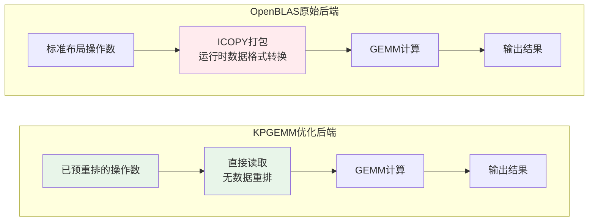

# 常量折叠优化

常量折叠是 ANNC 针对 GEMM（通用矩阵乘法）算子的全链路优化方案，由**前端预重排工具**、**编译期模式匹配与算子转换**和**定制免重排后端**三部分组成，通过将数据布局转换从运行时移至编译期，降低推理延迟。

## 优化原理

在传统 GEMM 计算中，OpenBLAS 等高性能库要求输入数据采用特定的分块内存布局以充分利用 SIMD 指令和 CPU 缓存。这种数据重排通常在**运行时**执行，带来额外的性能开销。

对于包含**常量操作数**的 MatMul 算子（如推理场景中训练后固定的模型参数），存在显著的优化空间：由于常量数据在编译期即可确定，可以将耗时的数据重排操作从运行时提前到编译期完成，从而消除运行时的转换开销。

ANNC 的常量折叠优化针对这一场景设计，通过以下架构实现：

```
┌──────────────────────────────────────────────────────┐
│              编译期（离线预处理）                      │
├──────────────────────────────────────────────────────┤
│  annc-opt 工具                                       │
│                                                      │
│  ├─ 识别包含常量操作数的 MatMul 算子                   │
│  ├─ 将上述算子的常量操作数由标准布局转换为             │
│  │   KPGEMM 优化的分块布局                             │
│  └─ 保存预重排后的模型                               │
└──────────────────────┬───────────────────────────────┘
                       │
                       ▼
┌──────────────────────────────────────────────────────┐
│              编译期（XLA 编译）                        │
├──────────────────────────────────────────────────────┤
│  ANNC Flags: --layout-matmul                         │
│                                                      │
│  ├─ 识别包含常量操作数的 MatMul 算子                   │
│  ├─ 转换为 Fusion + CustomCall 结构                  │
│  └─ 路由到 KPGEMM 后端（而非 OpenBLAS）              │
└──────────────────────┬───────────────────────────────┘
                       │
                       ▼
┌──────────────────────────────────────────────────────┐
│              运行时（推理执行）                        │
├──────────────────────────────────────────────────────┤
│  KPGEMM 后端                                         │
│                                                      │
│  ├─ 直接读取已预重排的操作数数据                       │
│  ├─ 无需运行时数据转换                               │
│  └─ 执行高效的 GEMM 计算                             │
└──────────────────────────────────────────────────────┘
```

**核心思想**：将 OpenBLAS 需要的运行时重排操作，提前到编译期由 annc-opt 工具完成，并配合定制的 KPGEMM 后端直接消费预重排数据，实现零运行时转换开销。

## 技术架构

### 1. 前端预重排工具（annc-opt）

在模型部署前对 TensorFlow SavedModel 进行离线预处理：

```bash
annc-opt -I input_model.pb -O output_dir layout_matmul
```

处理流程：
- **常量操作数识别**：扫描 MatMul 算子，识别常量类型的操作数
- **布局转换**：将常量操作数的标准行列布局转换为 KPGEMM 优化的分块布局
  - LHS 常量矩阵：`(m, k)` → `(m/4, k/4, 4, 4)` 四维分块
  - RHS 常量矩阵：`(k, n)` → `(n/4, k, 4)` 三维分块
- **边界处理**：遵循 OpenBLAS 运行时数据重排的边界处理规则，确保与非预重排场景的行为一致性
- **属性标记**：为识别和处理的 MatMul 算子添加自定义属性标签，供编译期模式匹配识别
- **模型保存**：将重排后的常量操作数及标记算子保存至输出模型

### 2. 编译期模式匹配与算子转换

通过 `--layout-matmul` 标志启用 XLA 编译期的模式匹配和算子路由：

```bash
export ANNC_FLAGS="--layout-matmul"
```

编译期处理流程：
- **模式匹配**：识别符合优化条件的 MatMul 算子（包含常量操作数）
- **算子转换**：将匹配的算子转换为 Fusion + CustomCall 结构，调用定制矩阵乘后端
- **后端路由**：CustomCall 注册到 KPGEMM 后端，运行时执行定制的免重排矩阵乘计算

### 3. KPGEMM 免重排后端

KPGEMM 是 ANNC **专为预重排数据而定制**的 GEMM 后端。与标准 OpenBLAS 不同，KPGEMM 的设计前提是输入矩阵 A 已经采用特定的分块布局（由前端 annc-opt 工具预重排生成），因此**必须配合预重排的常量数据使用**。

**工作原理：**

标准 OpenBLAS 在运行时需要执行数据打包操作，将标准布局的矩阵转换为优化的分块布局。KPGEMM 针对预重排数据的特性进行了定制设计，**直接读取已预重排的矩阵数据，跳过运行时的 ICOPY 打包阶段**，从而消除数据转换开销。



*图：OpenBLAS 原始后端与 KPGEMM 优化后端对比，红色节点表示运行时数据重排开销*

## 配置与使用

### 完整工作流程

```bash
# 步骤1：离线预处理（编译期）
annc-opt -I model.pb -O optimized_model layout_matmul

# 步骤2：设置环境变量启用 layout-matmul 优化
export ANNC_FLAGS="--layout-matmul"

# 步骤3：部署优化后的模型，运行时自动路由到 KPGEMM 后端
```

### 组合优化

```bash
# 启用所有 GEMM 相关优化（包括 layout-matmul）
export ANNC_FLAGS="--gemm-opt"
```

该优化方案通过编译期预处理和定制后端的协同工作，实现了常量操作数 GEMM 算子的零运行时重排开销，特别适用于对推理延迟敏感的深度学习服务场景。
